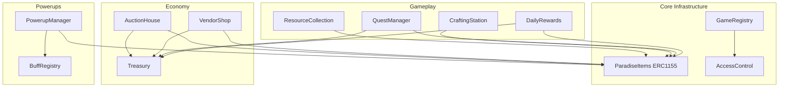

# Paradise Chain L1 - Smart Contracts

[](https://opensource.org/licenses/MIT)
[](https://soliditylang.org/)

Smart contracts for Paradise Tycoon's L1 blockchain. This repository contains the on-chain game logic for marketplace, resource collection, crafting, quests, powerups, and economy systems.

## Overview

Paradise Chain L1 is an Avalanche Subnet-EVM blockchain running at:
- **Mainnet**: Chain ID `15135`

These contracts implement critical game mechanics on-chain, providing transparency, immutability, and verifiable game state.

## Architecture



## Contracts

### Core Infrastructure

- **`AccessControl.sol`** - Role-based access control (Admin, Game Contract, Operator)
- **`GameRegistry.sol`** - Central registry for game contracts and item metadata
- **`ParadiseItems.sol`** - ERC-1155 multi-token contract for all in-game items

### Economy

- **`Treasury.sol`** - Central treasury for fee collection and reward distribution
- **`AuctionHouse.sol`** - Player-to-player marketplace with configurable fees
- **`VendorShop.sol`** - NPC vendor purchases with stock management

### Gameplay

- **`ResourceCollection.sol`** - Resource collection validation with tool durability
- **`CraftingStation.sol`** - Blueprint-based crafting with resource burning
- **`QuestManager.sol`** - Quest progress tracking and reward distribution
- **`DailyRewards.sol`** - Daily login rewards with 7-day streak cycles

### Powerups

- **`BuffRegistry.sol`** - Buff definitions and configurations
- **`PowerupManager.sol`** - Temporary buff activation and duration tracking

## Installation

```bash
npm install
```

## Configuration

1. Copy `.env.example` to `.env`
2. Fill in your deployment keys and RPC URLs:

```bash
PRIVATE_KEY=your_private_key_here
MAINNET_RPC_URL=https://rpc.paradise.cloud/ext/bc/YOUR_BLOCKCHAIN_ID/rpc
```

## Compile

```bash
npm run compile
```

## Test

```bash
npm test
```

## Deploy

```bash
npm run deploy:mainnet
```

Deployment addresses are saved to `deployments/` directory.

## Code Quality

### Lint

```bash
npm run lint
```

### Format

```bash
npm run format
```

### Gas Report

```bash
REPORT_GAS=true npm test
```

## Security

**⚠️ WARNING: These contracts are provided as-is and have NOT been audited. Use at your own risk.**

See [SECURITY.md](SECURITY.md) for our security policy and responsible disclosure process.

## License

MIT License - see [LICENSE](LICENSE) file for details.

## Contributing

See [CONTRIBUTING.md](CONTRIBUTING.md) for contribution guidelines.

## Documentation

- Contract interfaces: `contracts/interfaces/`
- Deployment scripts: `scripts/`
- Tests: `test/`

## Network Information

- **Explorer**: https://explorer.paradise.cloud
- **RPC**: https://rpc.paradise.cloud/ext/bc/[BLOCKCHAIN_ID]/rpc
- **Native Token**: MOANI (18 decimals)
- **Gas Token**: MOANI

## Support

For issues and questions:
- GitHub Issues: https://github.com/empiresnotvampires/paradise-chain-l1/issues
- Security: See [SECURITY.md](SECURITY.md)
